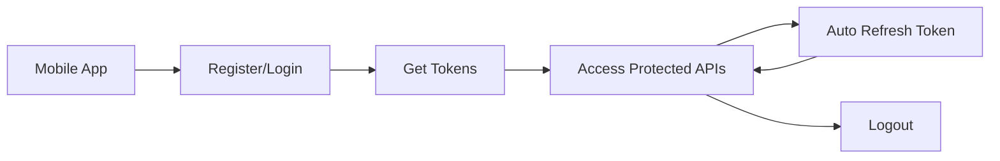

# API Integration Guide - Chat Realtime Backend

## 📋 **Tổng quan**

Đây là tài liệu hướng dẫn tích hợp API cho ứng dụng Chat Realtime. Backend được xây dựng bằng NestJS với kiến trúc modular, clean architecture và security-first approach.

### **Base URL**
```
Development: http://localhost:3000
Production: https://your-domain.com
```

### **API Documentation**
```
Swagger UI: http://localhost:3000/api-docs
OpenAPI JSON: http://localhost:3000/api-docs-json
```

---

## 🏗️ **Kiến trúc API**

### **Module Structure**
```
📁 API Modules
├── 🔐 Authentication (/auth)
│   ├── Register, Login, Logout
│   ├── Token refresh
│   └── Profile management
├── 📱 Device Management (/devices)
│   ├── Device registration
│   ├── Device listing & management
│   └── Push token management
├── 👥 Users (/users) [Coming Soon]
├── 💬 Messages (/messages) [Coming Soon]
├── 📁 Files (/files) [Coming Soon]
└── 👋 Friends (/friends) [Coming Soon]
```

### **Authentication Flow**


---

## 🔐 **Authentication & Security**

### **Token System**
- **Access Token**: JWT, 15 phút, dùng cho API calls
- **Refresh Token**: JWT, 7 ngày, dùng để gia hạn access token
- **Device Binding**: Tokens được bind với thiết bị cụ thể

### **Security Headers**
```http
Authorization: Bearer {access_token}
Content-Type: application/json
User-Agent: YourApp/1.0.0
X-Device-ID: {device_uuid}
```

### **Rate Limiting**
- **Login**: 5 lần/số điện thoại/15 phút
- **Register**: 3 lần/IP/giờ
- **API Calls**: 100 requests/phút/user
- **Token Refresh**: 10 lần/thiết bị/phút

---

## 📱 **Device Management System**

### **Device Limits**
- **Tối đa 5 thiết bị/user**
- **Auto cleanup**: Thiết bị cũ nhất bị xóa khi vượt limit
- **Device tracking**: Login history, platform info

### **Device Types**
```typescript
enum DeviceType {
  MOBILE = 'mobile',
  WEB = 'web', 
  DESKTOP = 'desktop',
  TABLET = 'tablet'
}

enum Platform {
  IOS = 'ios',
  ANDROID = 'android',
  WEB = 'web',
  WINDOWS = 'windows',
  MACOS = 'macos'
}
```

---

## 🚀 **Quick Start Integration**

### **1. Install Dependencies**

#### **React Native**
```bash
npm install @react-native-async-storage/async-storage
npm install react-native-device-info
npm install @react-native-firebase/messaging  # For push notifications
npm install axios  # For HTTP requests
```

#### **React Web**
```bash
npm install axios
npm install js-cookie  # For token storage
```

### **2. Setup HTTP Client**
```typescript
// utils/httpClient.ts
import axios from 'axios';
import AsyncStorage from '@react-native-async-storage/async-storage'; // React Native
// import Cookies from 'js-cookie'; // React Web

const API_BASE_URL = 'http://localhost:3000';

const httpClient = axios.create({
  baseURL: API_BASE_URL,
  timeout: 10000,
  headers: {
    'Content-Type': 'application/json',
  },
});

// Request interceptor - Add auth token
httpClient.interceptors.request.use(async (config) => {
  try {
    const token = await AsyncStorage.getItem('accessToken');
    // const token = Cookies.get('accessToken'); // Web version
    
    if (token) {
      config.headers.Authorization = `Bearer ${token}`;
    }
  } catch (error) {
    console.error('Error getting token:', error);
  }
  
  return config;
});

// Response interceptor - Handle token refresh
httpClient.interceptors.response.use(
  (response) => response,
  async (error) => {
    const originalRequest = error.config;

    if (error.response?.status === 401 && !originalRequest._retry) {
      originalRequest._retry = true;

      try {
        const refreshToken = await AsyncStorage.getItem('refreshToken');
        
        if (!refreshToken) {
          throw new Error('No refresh token');
        }

        // Refresh token
        const response = await axios.post(`${API_BASE_URL}/auth/refresh-token`, {
          refreshToken,
        });

        const { accessToken, refreshToken: newRefreshToken } = response.data.tokens;

        // Save new tokens
        await AsyncStorage.setItem('accessToken', accessToken);
        await AsyncStorage.setItem('refreshToken', newRefreshToken);

        // Retry original request
        originalRequest.headers.Authorization = `Bearer ${accessToken}`;
        return httpClient(originalRequest);

      } catch (refreshError) {
        // Refresh failed - redirect to login
        await AsyncStorage.multiRemove(['accessToken', 'refreshToken']);
        // NavigationService.navigate('Login');
        return Promise.reject(refreshError);
      }
    }

    return Promise.reject(error);
  }
);

export default httpClient;
```

### **3. Auth Service**
```typescript
// services/authService.ts
import httpClient from '../utils/httpClient';
import AsyncStorage from '@react-native-async-storage/async-storage';
import DeviceInfo from 'react-native-device-info';
import { Platform } from 'react-native';

interface LoginCredentials {
  phoneNumber: string;
  password: string;
}

interface RegisterCredentials extends LoginCredentials {
  confirmPassword: string;
  fullName?: string;
}

class AuthService {
  // Generate device info
  private async getDeviceInfo() {
    const deviceId = await DeviceInfo.getUniqueId();
    
    return {
      deviceId,
      deviceName: await DeviceInfo.getDeviceName(),
      deviceType: DeviceInfo.isTablet() ? 'tablet' : 'mobile',
      platform: Platform.OS,
      appVersion: DeviceInfo.getVersion(),
    };
  }

  // Register new user
  async register(credentials: RegisterCredentials) {
    const deviceInfo = await this.getDeviceInfo();
    
    const response = await httpClient.post('/auth/register', {
      ...credentials,
      deviceInfo,
    });

    // Save tokens
    const { tokens } = response.data;
    await this.saveTokens(tokens);

    return response.data;
  }

  // Login user
  async login(credentials: LoginCredentials) {
    const deviceInfo = await this.getDeviceInfo();
    
    const response = await httpClient.post('/auth/login', {
      ...credentials,
      deviceInfo,
    });

    // Save tokens
    const { tokens } = response.data;
    await this.saveTokens(tokens);

    return response.data;
  }

  // Get user profile
  async getProfile() {
    const response = await httpClient.get('/auth/profile');
    return response.data;
  }

  // Logout
  async logout() {
    try {
      await httpClient.post('/auth/logout');
    } catch (error) {
      console.error('Logout error:', error);
    } finally {
      await this.clearTokens();
    }
  }

  // Save tokens to storage
  private async saveTokens(tokens: any) {
    await AsyncStorage.multiSet([
      ['accessToken', tokens.accessToken],
      ['refreshToken', tokens.refreshToken],
    ]);
  }

  // Clear tokens from storage
  private async clearTokens() {
    await AsyncStorage.multiRemove(['accessToken', 'refreshToken']);
  }

  // Check if user is authenticated
  async isAuthenticated(): Promise<boolean> {
    try {
      const token = await AsyncStorage.getItem('accessToken');
      return !!token;
    } catch {
      return false;
    }
  }
}

export const authService = new AuthService();
```

### **4. React Context Setup**
```typescript
// contexts/AuthContext.tsx
import React, { createContext, useContext, useReducer, useEffect } from 'react';
import { authService } from '../services/authService';

interface AuthState {
  user: any | null;
  isLoading: boolean;
  isAuthenticated: boolean;
  error: string | null;
}

const initialState: AuthState = {
  user: null,
  isLoading: true,
  isAuthenticated: false,
  error: null,
};

type AuthAction =
  | { type: 'SET_LOADING'; payload: boolean }
  | { type: 'LOGIN_SUCCESS'; payload: any }
  | { type: 'LOGOUT' }
  | { type: 'SET_ERROR'; payload: string }
  | { type: 'CLEAR_ERROR' };

const authReducer = (state: AuthState, action: AuthAction): AuthState => {
  switch (action.type) {
    case 'SET_LOADING':
      return { ...state, isLoading: action.payload };
    case 'LOGIN_SUCCESS':
      return {
        ...state,
        user: action.payload.user,
        isAuthenticated: true,
        error: null,
      };
    case 'LOGOUT':
      return {
        ...state,
        user: null,
        isAuthenticated: false,
        error: null,
      };
    case 'SET_ERROR':
      return { ...state, error: action.payload, isLoading: false };
    case 'CLEAR_ERROR':
      return { ...state, error: null };
    default:
      return state;
  }
};

const AuthContext = createContext<{
  state: AuthState;
  login: (phoneNumber: string, password: string) => Promise<void>;
  register: (phoneNumber: string, password: string, confirmPassword: string, fullName?: string) => Promise<void>;
  logout: () => Promise<void>;
  clearError: () => void;
}>({} as any);

export const AuthProvider: React.FC<{ children: React.ReactNode }> = ({ children }) => {
  const [state, dispatch] = useReducer(authReducer, initialState);

  // Check auth status on app start
  useEffect(() => {
    checkAuthStatus();
  }, []);

  const checkAuthStatus = async () => {
    try {
      if (await authService.isAuthenticated()) {
        const user = await authService.getProfile();
        dispatch({ type: 'LOGIN_SUCCESS', payload: { user } });
      }
    } catch (error) {
      console.error('Auth check failed:', error);
    } finally {
      dispatch({ type: 'SET_LOADING', payload: false });
    }
  };

  const login = async (phoneNumber: string, password: string) => {
    try {
      dispatch({ type: 'SET_LOADING', payload: true });
      dispatch({ type: 'CLEAR_ERROR' });

      const response = await authService.login({ phoneNumber, password });
      dispatch({ type: 'LOGIN_SUCCESS', payload: response });
    } catch (error: any) {
      dispatch({ type: 'SET_ERROR', payload: error.message });
      throw error;
    } finally {
      dispatch({ type: 'SET_LOADING', payload: false });
    }
  };

  const register = async (phoneNumber: string, password: string, confirmPassword: string, fullName?: string) => {
    try {
      dispatch({ type: 'SET_LOADING', payload: true });
      dispatch({ type: 'CLEAR_ERROR' });

      const response = await authService.register({
        phoneNumber,
        password,
        confirmPassword,
        fullName,
      });
      dispatch({ type: 'LOGIN_SUCCESS', payload: response });
    } catch (error: any) {
      dispatch({ type: 'SET_ERROR', payload: error.message });
      throw error;
    } finally {
      dispatch({ type: 'SET_LOADING', payload: false });
    }
  };

  const logout = async () => {
    await authService.logout();
    dispatch({ type: 'LOGOUT' });
  };

  const clearError = () => {
    dispatch({ type: 'CLEAR_ERROR' });
  };

  return (
    <AuthContext.Provider value={{ state, login, register, logout, clearError }}>
      {children}
    </AuthContext.Provider>
  );
};

export const useAuth = () => {
  const context = useContext(AuthContext);
  if (!context) {
    throw new Error('useAuth must be used within AuthProvider');
  }
  return context;
};
```

### **5. Usage Examples**

#### **Login Screen**
```typescript
// screens/LoginScreen.tsx
import React, { useState } from 'react';
import { View, TextInput, TouchableOpacity, Text, Alert } from 'react-native';
import { useAuth } from '../contexts/AuthContext';

export const LoginScreen: React.FC = () => {
  const [phoneNumber, setPhoneNumber] = useState('');
  const [password, setPassword] = useState('');
  const { state, login } = useAuth();

  const handleLogin = async () => {
    try {
      await login(phoneNumber, password);
      // Navigation will be handled by auth state change
    } catch (error) {
      Alert.alert('Login Failed', 'Please check your credentials');
    }
  };

  return (
    <View style={styles.container}>
      <TextInput
        placeholder="Phone Number (+84...)"
        value={phoneNumber}
        onChangeText={setPhoneNumber}
        keyboardType="phone-pad"
        style={styles.input}
      />
      
      <TextInput
        placeholder="Password"
        value={password}
        onChangeText={setPassword}
        secureTextEntry
        style={styles.input}
      />
      
      <TouchableOpacity 
        onPress={handleLogin}
        disabled={state.isLoading}
        style={styles.button}
      >
        <Text style={styles.buttonText}>
          {state.isLoading ? 'Logging in...' : 'Login'}
        </Text>
      </TouchableOpacity>
      
      {state.error && (
        <Text style={styles.error}>{state.error}</Text>
      )}
    </View>
  );
};
```

---

## 📚 **Available API Documentation**

### **Completed Modules**
1. **[Authentication API](./01-authentication-api.md)**
   - User registration and login
   - Token management
   - Profile endpoints

2. **[Device Management API](./02-device-management-api.md)**
   - Device registration and tracking
   - Device limit enforcement
   - Push token management

### **Coming Soon**
3. **Users API** - User profile management
4. **Messages API** - Chat messaging system
5. **Files API** - File upload and sharing
6. **Friends API** - Friend connections
7. **WebSocket Events** - Real-time communication

---

## ⚠️ **Error Handling**

### **Standard Error Response**
```typescript
interface ApiError {
  statusCode: number;
  message: string | string[];
  error: string;
  timestamp?: string;
  path?: string;
}
```

### **Common HTTP Status Codes**
- **200**: Success
- **201**: Created successfully
- **400**: Bad request (validation errors)
- **401**: Unauthorized (invalid/expired token)
- **403**: Forbidden (insufficient permissions)
- **404**: Not found
- **409**: Conflict (duplicate data)
- **422**: Unprocessable entity
- **429**: Too many requests (rate limited)
- **500**: Internal server error

### **Error Handling Best Practices**
```typescript
const handleApiError = (error: any) => {
  if (error.response) {
    const { status, data } = error.response;
    
    switch (status) {
      case 400:
        return `Validation error: ${Array.isArray(data.message) ? data.message.join(', ') : data.message}`;
      case 401:
        return 'Please login again';
      case 403:
        return 'Access denied';
      case 404:
        return 'Resource not found';
      case 409:
        return 'Resource already exists';
      case 429:
        return 'Too many requests. Please wait.';
      default:
        return 'An unexpected error occurred';
    }
  }
  
  return 'Network error. Please check your connection.';
};
```

---

## 🔧 **Development Setup**

### **Environment Variables**
```env
# App Configuration
NODE_ENV=development
PORT=3000

# Database
MONGODB_URI=mongodb://localhost:27017/chat-realtime
REDIS_URL=redis://localhost:6379

# JWT Configuration
JWT_SECRET=your-super-secret-key
JWT_ACCESS_EXPIRE=15m
JWT_REFRESH_EXPIRE=7d

# Rate Limiting
RATE_LIMIT_TTL=60
RATE_LIMIT_LIMIT=100
```

### **Running the Backend**
```bash
# Install dependencies
npm install

# Start development server
npm run start:dev

# View API documentation
open http://localhost:3000/api-docs
```

### **Testing APIs**
```bash
# Health check
curl http://localhost:3000/auth/health

# Register user
curl -X POST http://localhost:3000/auth/register \
  -H "Content-Type: application/json" \
  -d '{
    "phoneNumber": "+84901234567",
    "password": "TestPass123!",
    "confirmPassword": "TestPass123!",
    "fullName": "Test User",
    "deviceInfo": {
      "deviceId": "test-device-123",
      "deviceName": "Test Device",
      "deviceType": "mobile",
      "platform": "ios",
      "appVersion": "1.0.0"
    }
  }'
```

---

## 📞 **Support & Contact**

### **Team Backend**
- **API Questions**: backend-team@company.com
- **Bug Reports**: Use GitHub Issues
- **Documentation**: This document is updated regularly

### **Resources**
- **Swagger UI**: http://localhost:3000/api-docs
- **Postman Collection**: [Download link]
- **GitHub Repository**: [Repository link]

---

**📝 Note**: Tài liệu này sẽ được cập nhật thường xuyên khi có thêm modules mới. Hãy check lại để có thông tin mới nhất.
