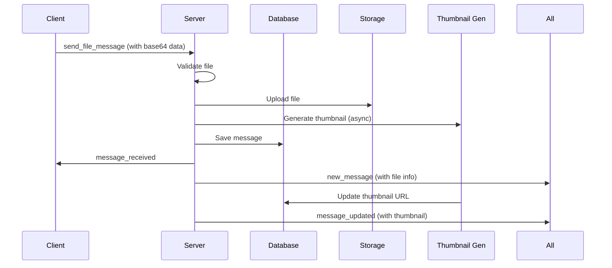
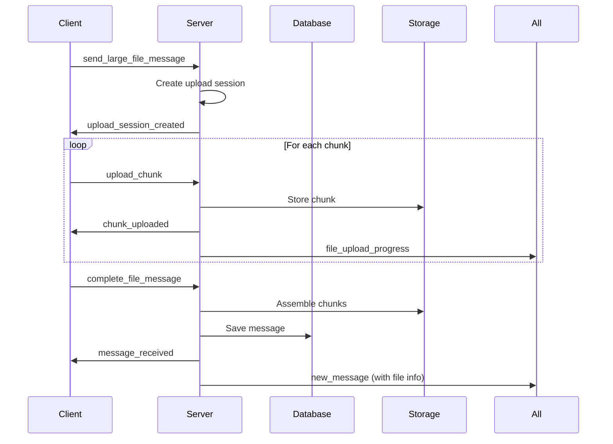

# 🚀 Socket Message Architecture - Unified Approach

## **📋 OVERVIEW**

### **🎯 Design Goals:**
- **Single Namespace**: `/chat` handles all message types including files
- **Seamless UX**: Upload và send message trong một flow
- **Mobile-First**: Tối ưu cho mobile experience như Zalo/Messenger
- **Real-time**: Instant feedback và progress updates

---

## **🏗️ ARCHITECTURE DESIGN**

### **1. Single Chat Gateway (`/chat`)**
```typescript
@WebSocketGateway({
    namespace: '/chat',
    cors: { origin: '*', methods: ['GET', 'POST'] },
    transports: ['websocket', 'polling'],
    maxHttpBufferSize: 50e6, // 50MB for file uploads
})
export class ChatGateway {
    // Message Types Handled:
    // 1. 📝 Text messages
    // 2. 📎 File messages (with upload)
    // 3. 🖼️ Image messages (with thumbnail)
    // 4. 🎵 Voice messages
    // 5. 📹 Video messages
    // 6. 📄 Document messages
}
```

### **2. Message Flow Types:**

#### **A. Text Messages (Simple)**
```
Client -> send_message -> Server -> save_to_db -> broadcast -> All Clients
```

#### **B. File Messages (Complex)**
```
Client -> send_file_message -> Server:
    1. Validate file
    2. Upload to storage
    3. Generate thumbnail (if applicable)
    4. Save message to DB
    5. Broadcast with file metadata
    -> All Clients receive message + file info
```

---

## **🎮 SOCKET EVENTS DESIGN**

### **📤 Client -> Server Events:**

#### **1. Text Message:**
```typescript
// Event: 'send_message'
interface SendTextMessageDto {
    localId: string;
    conversationId: string;
    content: string;
    type: 'text';
    timestamp: number;
    // Optional
    replyToId?: string;
    mentions?: string[];
}
```

#### **2. File Message (Small Files <10MB):**
```typescript
// Event: 'send_file_message'  
interface SendFileMessageDto {
    localId: string;
    conversationId: string;
    content?: string; // Optional caption
    type: 'image' | 'audio' | 'video' | 'document';
    timestamp: number;
    
    // File data
    fileName: string;
    fileSize: number;
    mimeType: string;
    fileData: string; // Base64 encoded
    
    // Optional
    replyToId?: string;
}
```

#### **3. Large File Message (Chunked Upload):**
```typescript
// Event: 'send_large_file_message'
interface SendLargeFileMessageDto {
    localId: string;
    conversationId: string;
    content?: string;
    type: 'video' | 'document';
    timestamp: number;
    
    // File metadata
    fileName: string;
    fileSize: number;
    mimeType: string;
    totalChunks: number;
    
    // First chunk
    chunkIndex: 0;
    chunkData: string; // Base64
}

// Follow-up events: 'upload_chunk', 'complete_file_message'
```

### **📥 Server -> Client Events:**

#### **1. Message Acknowledgments:**
```typescript
// Event: 'message_received'
interface MessageReceivedResponse {
    localId: string;
    serverId: string;
    status: 'received' | 'processed' | 'failed';
    timestamp: number;
    processingTime: number;
    error?: string;
}
```

#### **2. New Messages Broadcast:**
```typescript
// Event: 'new_message'
interface NewMessageBroadcast {
    id: string;
    conversationId: string;
    senderId: string;
    senderName: string;
    content: string;
    messageType: 'text' | 'image' | 'audio' | 'video' | 'document';
    timestamp: number;
    
    // File-specific data (when applicable)
    fileInfo?: {
        id: string;
        fileName: string;
        fileSize: number;
        mimeType: string;
        downloadUrl: string;
        thumbnailUrl?: string;
        duration?: number; // For audio/video
    };
    
    // Optional
    replyTo?: MessageReference;
    mentions?: string[];
}
```

#### **3. File Upload Progress:**
```typescript
// Event: 'file_upload_progress'
interface FileUploadProgress {
    localId: string;
    conversationId: string;
    progress: number; // 0-100
    uploadSpeed?: number; // bytes/sec
    remainingTime?: number; // seconds
    currentChunk?: number;
    totalChunks?: number;
}
```

---

## **🔄 MESSAGE PROCESSING FLOW**

### **📝 Text Message Flow:**
1. **Client** -> `send_message` 
2. **Server** -> Validate & Save to DB
3. **Server** -> `message_received` (to sender)
4. **Server** -> `new_message` (broadcast to conversation)

### **📎 File Message Flow:**

#### **Small Files (≤10MB):**


#### **Large Files (>10MB):**


---

## **🎯 IMPLEMENTATION STRATEGY**

### **Phase 1: Enhance Current Chat Gateway**
1. ✅ Add file upload capability to ChatGateway
2. ✅ Implement small file handling (<10MB)
3. ✅ Add thumbnail generation integration
4. ✅ Update message broadcast with file metadata

### **Phase 2: Large File Support**
1. ✅ Add chunked upload to ChatGateway
2. ✅ Implement upload progress tracking
3. ✅ Add upload session management
4. ✅ Handle upload resumption

### **Phase 3: Advanced Features**
1. ✅ Voice message recording
2. ✅ Image compression
3. ✅ Video thumbnail extraction
4. ✅ File preview generation

### **Phase 4: Mobile Optimization**
1. ✅ Automatic quality adjustment
2. ✅ Network-aware uploading
3. ✅ Offline queue management
4. ✅ Background processing

---

## **📱 MOBILE-FIRST CONSIDERATIONS**

### **🔋 Battery & Performance:**
- **Chunked Upload**: Prevent memory overflow
- **Progress Feedback**: Keep user informed
- **Background Processing**: Continue when app is backgrounded
- **Quality Adjustment**: Auto-compress based on network

### **📶 Network Handling:**
- **Adaptive Bitrate**: Adjust quality based on connection
- **Resume Support**: Handle network interruptions
- **Offline Queue**: Store and send when online
- **Compression**: Reduce data usage

### **🎨 UX Patterns:**
- **Instant Feedback**: Show message immediately with loading state
- **Progress Indicators**: Visual upload progress
- **Error Handling**: Graceful failure recovery
- **Retry Logic**: Auto-retry failed uploads

---

## **🔧 CONFIGURATION**

### **File Size Limits:**
```typescript
const FILE_LIMITS = {
    SMALL_FILE_MAX: 10 * 1024 * 1024,     // 10MB
    LARGE_FILE_MAX: 500 * 1024 * 1024,    // 500MB
    CHUNK_SIZE: 5 * 1024 * 1024,          // 5MB chunks
    
    // Type-specific limits
    IMAGE_MAX: 50 * 1024 * 1024,          // 50MB
    VIDEO_MAX: 500 * 1024 * 1024,         // 500MB
    AUDIO_MAX: 100 * 1024 * 1024,         // 100MB
    DOCUMENT_MAX: 200 * 1024 * 1024,      // 200MB
};
```

### **Socket Configuration:**
```typescript
const SOCKET_CONFIG = {
    maxHttpBufferSize: 50e6,    // 50MB
    pingTimeout: 120000,        // 2 minutes
    pingInterval: 30000,        // 30 seconds
    upgradeTimeout: 30000,      // 30 seconds
    connectTimeout: 45000,      // 45 seconds
};
```

---

## **✅ BENEFITS OF THIS APPROACH**

### **🎯 Developer Experience:**
- **Single API**: One gateway handles all message types
- **Consistent Flow**: Same pattern for all message types
- **Easier Testing**: Unified event handling
- **Better Debugging**: Centralized logging

### **📱 User Experience:**
- **Seamless UX**: Upload and send in one action
- **Real-time Feedback**: Instant progress updates
- **Mobile Optimized**: Handles network issues gracefully
- **Consistent UI**: Same message bubble for all types

### **🚀 Performance:**
- **Efficient Uploads**: Chunked for large files
- **Thumbnail Generation**: Async processing
- **Caching**: Reuse uploaded files
- **Compression**: Optimize file sizes

### **🔒 Security:**
- **Validation**: File type and size checking
- **Authentication**: User verification for all uploads
- **Access Control**: File sharing permissions
- **Virus Scanning**: Malware detection

---

## **🔄 MIGRATION PLAN**

### **Current State -> Target State:**

#### **Before (Current):**
```
/file-upload namespace -> Upload file -> Get fileId
/chat namespace -> send message with fileId
```

#### **After (Target):**
```
/chat namespace -> send_file_message -> Upload + Create Message + Broadcast
```

#### **Migration Steps:**
1. **Enhance ChatGateway** with file upload capabilities
2. **Add backward compatibility** for existing file-upload events
3. **Update client code** to use new unified events
4. **Deprecate** old file-upload namespace
5. **Remove** old implementation after full migration

This approach provides a more cohesive, mobile-friendly, and maintainable architecture for handling all types of messages in your chat application.
