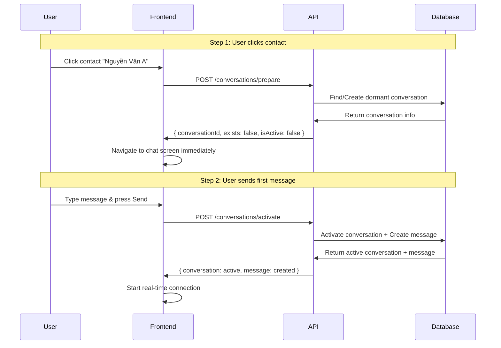

# 💬 Conversations Module

## **📋 Overview**

Module quản lý conversations (cuộc trò chuyện) trong hệ thống chat app, bao gồm việc tạo, kích hoạt và quản lý các cuộc trò chuyện 1-on-1 (direct messages).

### **🎯 Core Features**

- ✅ **Prepare Direct Conversation**: Chuẩn bị cuộc trò chuyện (tạo dormant conversation)
- ✅ **Activate Conversation**: Kích hoạt cuộc trò chuyện với tin nhắn đầu tiên
- ✅ **Real-time Messaging**: Tích hợp WebSocket cho tin nhắn real-time
- ✅ **Message Attachments**: Hỗ trợ gửi file, hình ảnh, video
- ✅ **User Status**: Hiển thị trạng thái online/offline của participants

---

## **🏗️ Architecture**

```
src/modules/conversations/
├── controllers/          # REST API endpoints
├── services/            # Business logic layer
├── repositories/        # Data access layer  
├── dto/                # Data transfer objects
├── schemas/            # MongoDB schemas
├── types/              # TypeScript type definitions
├── tests/              # Unit tests
└── documentation/      # API docs & examples
```

### **🔄 API Flow Design**

**Inspiration: Zalo/Messenger Pattern**



---

## **🚀 API Endpoints**

### **1. Prepare Direct Conversation**
```http
POST /api/v1/conversations/prepare
```

**Use Case:** User click vào contact trong contact list

**Request:**
```json
{
  "participantId": "64f1a2b3c4d5e6f7a8b9c0d1"
}
```

**Response (New):**
```json
{
  "conversationId": "64f2b3c4d5e6f7a8b9c0d2e3",
  "exists": false,
  "isActive": false,
  "participant": {
    "id": "64f1a2b3c4d5e6f7a8b9c0d1",
    "username": "nguyenvana",
    "fullName": "Nguyễn Văn A",
    "avatarUrl": "https://example.com/avatar.jpg",
    "isOnline": true,
    "lastSeen": "2025-01-20T10:30:00.000Z"
  }
}
```

**Response (Existing):**
```json
{
  "conversationId": "64f2b3c4d5e6f7a8b9c0d2e3", 
  "exists": true,
  "isActive": true,
  "participant": {
    "id": "64f1a2b3c4d5e6f7a8b9c0d1",
    "username": "nguyenvana", 
    "fullName": "Nguyễn Văn A",
    "avatarUrl": "https://example.com/avatar.jpg",
    "isOnline": false,
    "lastSeen": "2025-01-20T09:15:00.000Z"
  }
}
```

### **2. Activate Conversation**
```http
POST /api/v1/conversations/activate
```

**Use Case:** User gửi tin nhắn đầu tiên

**Request:**
```json
{
  "conversationId": "64f2b3c4d5e6f7a8b9c0d2e3",
  "initialMessage": {
    "content": {
      "text": "Chào bạn! Bạn có khỏe không? 😊",
      "mentions": []
    },
    "messageType": "text",
    "attachments": [],
    "metadata": {
      "platform": "web",
      "deviceInfo": "Chrome 96.0"
    }
  }
}
```

**Response:**
```json
{
  "conversation": {
    "id": "64f2b3c4d5e6f7a8b9c0d2e3",
    "type": "direct",
    "participants": [...],
    "isActive": true,
    "lastMessage": {...}
  },
  "message": {
    "id": "64f3c5d6e7f8a9b0c1d2e3f4",
    "conversationId": "64f2b3c4d5e6f7a8b9c0d2e3", 
    "senderId": "64f0a1b2c3d4e5f6a7b8c9d0",
    "content": {...},
    "createdAt": "2025-01-20T11:05:00.000Z"
  },
  "created": true
}
```

---

## **💾 Database Schemas**

### **Conversation Schema**
```typescript
{
  _id: ObjectId,
  type: 'direct' | 'group',
  participants: ObjectId[], // Reference to conversation_participants
  createdBy: ObjectId,      // User ID
  createdAt: Date,
  updatedAt: Date,
  lastMessage: ObjectId,    // Reference to messages
  lastActivity: Date,
  isActive: boolean,        // false = dormant, true = activated
  settings: {
    allowMessaging: boolean,
    allowCalls: boolean,
    muteNotifications: boolean
  }
}
```

### **Conversation Participant Schema**
```typescript
{
  _id: ObjectId,
  conversationId: ObjectId, // Reference to conversations
  userId: ObjectId,         // Reference to users
  role: 'admin' | 'member',
  joinedAt: Date,
  leftAt: Date,
  permissions: {
    canSendMessage: boolean,
    canAddMembers: boolean,
    canRemoveMembers: boolean
  }
}
```

### **Database Indexes**
```javascript
// conversations collection
db.conversations.createIndex({ "participants": 1, "type": 1 })
db.conversations.createIndex({ "lastActivity": -1 })
db.conversations.createIndex({ "isActive": 1 })

// conversation_participants collection  
db.conversation_participants.createIndex({ "conversationId": 1 })
db.conversation_participants.createIndex({ "userId": 1 })
db.conversation_participants.createIndex({ "conversationId": 1, "userId": 1 }, { unique: true })
```

---

## **🔧 Service Layer**

### **IConversationsService Interface**
```typescript
interface IConversationsService {
  // Prepare conversation (create dormant)
  prepareDirectConversation(
    userId: string, 
    dto: PrepareDirectConversationDto
  ): Promise<PrepareConversationResponseDto>;
  
  // Activate conversation with first message
  activateConversation(
    userId: string,
    dto: ActivateConversationDto
  ): Promise<ActivateConversationResponseDto>;
  
  // Get conversation details
  getConversationById(
    userId: string,
    conversationId: string
  ): Promise<ConversationDetailsDto>;
  
  // Check if user can access conversation
  validateUserAccess(
    userId: string,
    conversationId: string
  ): Promise<boolean>;
}
```

### **Business Logic Rules**

1. **Prepare Direct Conversation:**
   - ✅ User không thể tạo conversation với chính mình
   - ✅ Target user phải tồn tại trong database
   - ✅ Nếu conversation đã tồn tại → return existing
   - ✅ Nếu chưa tồn tại → tạo dormant conversation
   - ✅ Tự động add 2 participants với role 'admin'

2. **Activate Conversation:**
   - ✅ Conversation phải tồn tại và user phải là participant
   - ✅ Tạo message đầu tiên qua MessagesService
   - ✅ Update conversation: isActive = true, lastActivity = now
   - ✅ Return both conversation và message data

---

## **🎨 Frontend Integration**

### **React/Vue Component Example**
```typescript
// useConversation hook
const useConversation = () => {
  const [conversation, setConversation] = useState(null);
  const [messages, setMessages] = useState([]);
  const [loading, setLoading] = useState(false);

  const prepareConversation = async (participantId: string) => {
    setLoading(true);
    try {
      const result = await api.prepareConversation({ participantId });
      setConversation(result);
      return result;
    } finally {
      setLoading(false);
    }
  };

  const sendFirstMessage = async (messageText: string) => {
    if (!conversation) return;
    
    const result = await api.activateConversation({
      conversationId: conversation.conversationId,
      initialMessage: {
        content: { text: messageText, mentions: [] },
        messageType: 'text'
      }
    });
    
    setConversation(result.conversation);
    setMessages([result.message]);
    
    // Connect WebSocket for real-time
    connectWebSocket(result.conversation.id);
  };

  return {
    conversation,
    messages,
    loading,
    prepareConversation,
    sendFirstMessage
  };
};
```

### **Mobile App Integration**
```dart
// Flutter/Dart example
class ConversationService {
  Future<PrepareConversationResponse> prepareConversation(String participantId) async {
    final response = await dio.post('/conversations/prepare', 
      data: {'participantId': participantId}
    );
    return PrepareConversationResponse.fromJson(response.data);
  }
  
  Future<ActivateConversationResponse> activateConversation({
    required String conversationId,
    required InitialMessage initialMessage,
  }) async {
    final response = await dio.post('/conversations/activate', data: {
      'conversationId': conversationId,
      'initialMessage': initialMessage.toJson(),
    });
    return ActivateConversationResponse.fromJson(response.data);
  }
}

// Usage in Flutter widget
class ChatScreen extends StatefulWidget {
  final Contact contact;
  
  @override
  _ChatScreenState createState() => _ChatScreenState();
}

class _ChatScreenState extends State<ChatScreen> {
  ConversationService _service = ConversationService();
  PrepareConversationResponse? _conversation;
  List<Message> _messages = [];
  bool _isActive = false;
  
  @override
  void initState() {
    super.initState();
    _prepareConversation();
  }
  
  Future<void> _prepareConversation() async {
    final result = await _service.prepareConversation(widget.contact.id);
    setState(() {
      _conversation = result;
      _isActive = result.isActive;
    });
    
    if (result.isActive) {
      _loadMessages();
    }
  }
  
  Future<void> _sendFirstMessage(String text) async {
    if (_conversation == null) return;
    
    final result = await _service.activateConversation(
      conversationId: _conversation!.conversationId,
      initialMessage: InitialMessage(
        content: MessageContent(text: text, mentions: []),
        messageType: 'text',
      ),
    );
    
    setState(() {
      _isActive = true;
      _messages.add(result.message);
    });
    
    _connectWebSocket(result.conversation.id);
  }
}
```

---

## **🔒 Security & Authorization**

### **JWT Guards**
```typescript
@Controller('conversations')
@UseGuards(JwtAuthGuard)
@ApiBearerAuth()
export class ConversationsController {
  // All endpoints require JWT authentication
}
```

### **Participant Validation**
```typescript
// Service layer validation
private async validateUserAccess(userId: string, conversationId: string): Promise<boolean> {
  const participant = await this.participantsRepository.findByConversationAndUser(
    new Types.ObjectId(conversationId),
    new Types.ObjectId(userId)
  );
  return participant !== null;
}
```

---

## **⚡ Performance Optimizations**

### **Database Queries**
- ✅ Compound indexes for efficient lookups
- ✅ Populate user data in single query
- ✅ Pagination for message history
- ✅ Redis caching for active conversations

### **API Response Times**
- 🎯 Prepare API: < 200ms
- 🎯 Activate API: < 500ms  
- 🎯 Get conversation: < 100ms

### **Memory Management**
- ✅ Limit message payload size
- ✅ Compress attachments
- ✅ Clean up inactive WebSocket connections

---

## **🧪 Testing**

### **Unit Tests**
```bash
npm run test src/modules/conversations
```

### **Integration Tests**  
```bash
npm run test:e2e conversations
```

### **Manual Testing**
See [Testing Guide](./documentation/testing-guide.md) for detailed testing procedures.

---

## **📚 Documentation**

- 📖 [API Examples](./documentation/api-examples.md) - Complete API usage examples
- 🧪 [Testing Guide](./documentation/testing-guide.md) - Testing procedures and examples
- 🏗️ [Architecture Decisions](./documentation/architecture-decisions.md) - Design rationale

---

## **🚀 Deployment**

### **Environment Variables**
```bash
# MongoDB connection
MONGODB_URI=mongodb://localhost:27017/chat_app

# Redis connection (for real-time features)
REDIS_URL=redis://localhost:6379

# JWT configuration
JWT_SECRET=your-secret-key
JWT_EXPIRATION=7d

# File upload limits
MAX_FILE_SIZE=10485760  # 10MB
ALLOWED_MIME_TYPES=image/jpeg,image/png,image/gif,video/mp4
```

### **Docker Compose**
```yaml
version: '3.8'
services:
  app:
    build: .
    environment:
      - MONGODB_URI=mongodb://mongo:27017/chat_app
      - REDIS_URL=redis://redis:6379
    depends_on:
      - mongo
      - redis
      
  mongo:
    image: mongo:5.0
    ports:
      - "27017:27017"
      
  redis:
    image: redis:alpine
    ports:
      - "6379:6379"
```

---

## **🔄 Future Enhancements**

### **Phase 2 Features**
- [ ] Group conversations support
- [ ] Message reactions and replies
- [ ] File sharing with preview
- [ ] Voice messages
- [ ] Message search functionality

### **Phase 3 Features**
- [ ] Video/voice calling integration
- [ ] Message encryption
- [ ] Advanced admin controls
- [ ] Analytics and metrics
- [ ] Multi-device synchronization

---

## **🤝 Contributing**

1. Fork the repository
2. Create feature branch: `git checkout -b feature/conversations-enhancement`
3. Commit changes: `git commit -am 'Add new feature'`
4. Push to branch: `git push origin feature/conversations-enhancement`
5. Submit pull request

### **Code Standards**
- ✅ Follow existing TypeScript patterns
- ✅ Add unit tests for new features
- ✅ Update documentation
- ✅ Follow NestJS best practices

---

## **📞 Support**

- 🐛 **Bug Reports**: [GitHub Issues](https://github.com/your-repo/issues)
- 💡 **Feature Requests**: [GitHub Discussions](https://github.com/your-repo/discussions)  
- 📧 **Email**: support@your-app.com
- 💬 **Discord**: [Join our community](https://discord.gg/your-server)

---

**Built with ❤️ using NestJS, MongoDB, and TypeScript**
